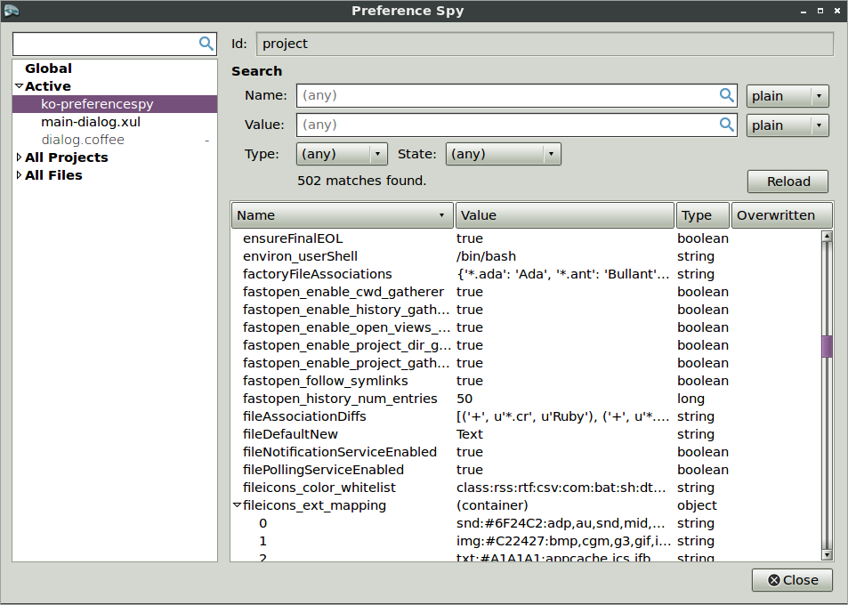

###The Basics
Preference Spy is an extension for [Komodo IDE](http://komodoide.com/) and [Komodo Edit](http://komodoide.com/komodo-edit/).
It simplifies inspecting user preferences.

###Installation
The extension XPI is available at https://github.com/ervumlens/ko-preferencespy/releases .

Once installed, the extension adds a new "Preference Spy" menu item under the main "Tools" menu.

###Usage

To view preferences, Open the "Tools" main menu and select "Preference Spy".

###Build

Building Preference Spy requires the [CoffeeScript](http://coffeescript.org) compiler available on the environment `PATH` and an installation of Komodo Edit or IDE.
The [`ko-preferencespy`](https://github.com/ervumlens/ko-preferencespy) repository includes Komodo macros that build the extension.
Just clone the repo, open a new Komodo project from within the `ko-preferencespy` directory, and run the macros from the Komodo toolbox.

###Questions? Problems? Suggestions?

Report bugs, make enhancement requests, or ask questions at https://github.com/ervumlens/ko-preferencespy/issues . Just click on the big "New Issue" button.

###Thank Yous

Thanks to Komodo Edit's developers and contributors, past and present, for making an editor that's enjoyable to use.

Thanks to Jeremy Ashkenas for creating CoffeeScript.

Thanks to @nathanr for his feedback on version 1.
